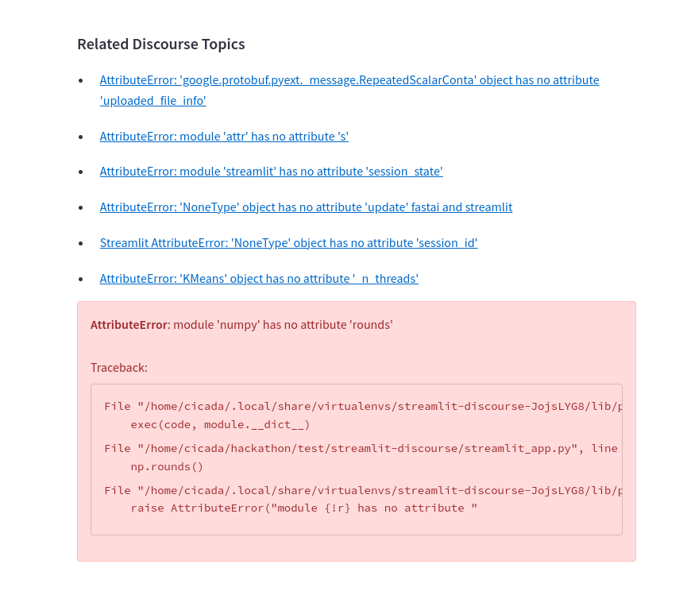

# streamlit-discourse
Streamlit component to display [Streamlit-Discourse] topics related to any exception.

## Installation

```bash
pip install git+https://github.com/snehankekre/streamlit-discourse
```

### Usage

```python
import streamlit as st
from streamlit_discourse import discourse

with discourse():
    import streamlit as st
    # Your code that may raise an exception here. E.g.
    import numpy as np
    np.rounds()
```

